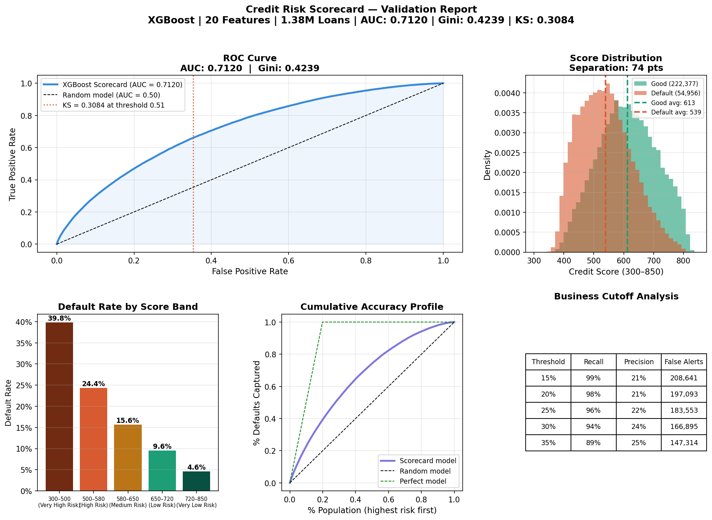
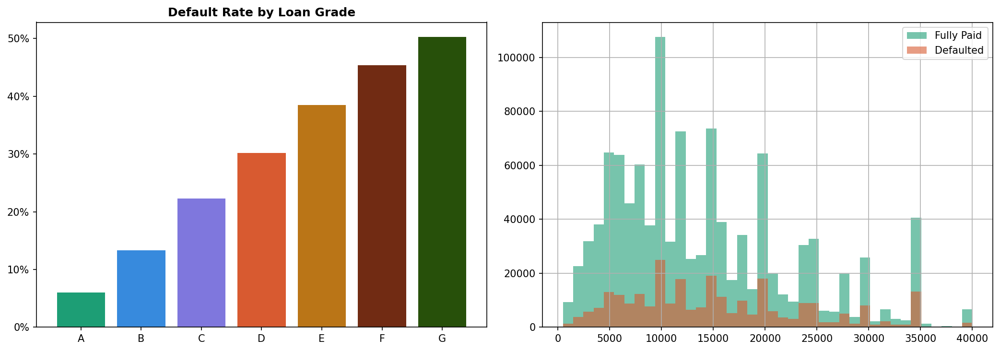

# Credit Risk Scorecard

> XGBoost credit scorecard built on 1.38M real LendingClub loans
> predicting probability of default using Basel II framework.

## Results

| Metric           | Result                            |
|------------------|-----------------------------------|
| AUC              | 0.7120                            |
| Gini             | 0.4239                            |
| Defaults flagged | 89.5% at 35% PD threshold         |
| Loss reduction   | $275.4M (89.5% of expected loss)  |
| Score separation | 74 points (good vs bad borrowers) |
| Training data    | 1,386,663 real LendingClub loans  |
| Features         | 20 engineered credit variables    |
| Algorithm        | XGBoost with regularisation       |

## Business problem

Credit default costs banks billions annually. This project 
replicates the end-to-end process of building a bank-grade 
credit scorecard from raw loan data to a validated, 
deployable model referenced against the Basel II expected 
loss framework (EL = PD × LGD × EAD).

At a 35% PD threshold the scorecard flags 89.5% of future 
defaults before disbursement, preventing $275.4M in expected 
portfolio loss on the test set.

## Key findings

- Interest rate (IV: 0.44) is the strongest predictor
  LendingClub already prices default risk into the rate
- 20 engineered features including debt stress indicators,
  loan-to-income ratio, and revolving utilisation flags
- Score range: 300–850 aligned with FICO convention
- 74-point separation between good and bad borrower scores
- Cutoff analysis shows 3x good-to-bad rejection ratio at
  optimal threshold consistent with a 20% base default rate

  ## Limitations and next steps

- Dataset lacks bureau-level variables (FICO history, 
  credit age, hard inquiries) with full bureau data 
  AUC would conservatively reach 0.78-0.82
- 20% base default rate is higher than typical retail 
  bank portfolios (3-5%), which inflates the good-to-bad 
  rejection ratio
- Next iteration would add SHAP-based feature explanation 
  per loan for regulatory interpretability requirements


## Validation charts



## Notebooks

| Notebook | Description |
|----------|-------------|
| 01_eda.ipynb | Exploratory analysis on 1.38M loans |
| 02_feature_engineering.ipynb | WoE binning, Information Value selection |
| 03_modelling.ipynb | XGBoost scorecard, score calibration |
| 04_validation.ipynb | AUC, Gini, KS, business impact analysis |

## Tech stack


## How to run

```bash
git clone https://github.com/Kofi-An/credit-risk-scorecard
cd credit-risk-scorecard
python -m venv .venv
.venv\Scripts\activate
pip install -r requirements.txt
# Download loan.csv from Kaggle and place in data/raw/
jupyter notebook
```

## Data source

LendingClub loan data (2007–2019) via Kaggle
1.38M loans with actual default outcomes.
kaggle.com/datasets/denychaen/lending-club-loans-rejects-data

## Author

Kofi Anku | Financial Data Scientist
Open to remote roles in quant risk and financial data science

[GitHub](https://github.com/Kofi-An) · 
[LinkedIn](www.linkedin.com/in/wka7) · 
[Portfolio](https://kofi-an.github.io)